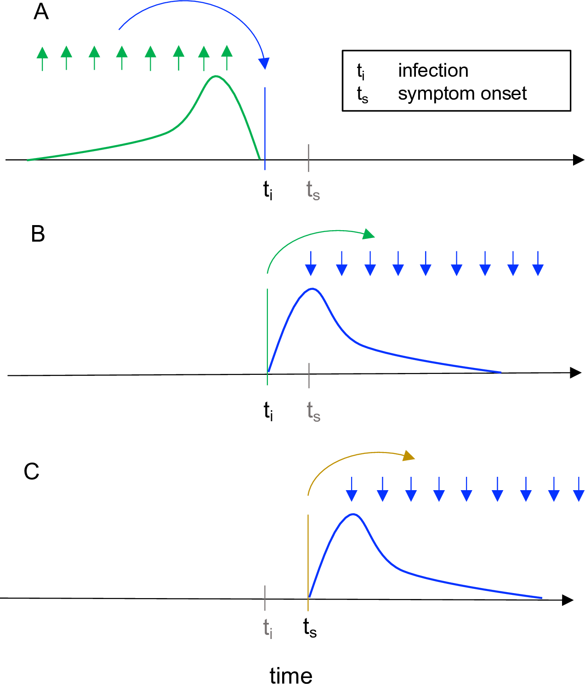

# Instantaneous Reproduction number ($R_t$) estimation for Dengue in HCMC, Vietnam

This repository is a collaborative project between the **Department of Surveillance, Warning, Preparedness, and Emergency Response** (SWAPER), part of **Ho Chi Minh City Centre for Disease Control** (HCDC), and the Mathematical Modelling group at the **Oxford University Clinical Research Unit** (OUCRU), both based in Ho Chi Minh City (HCMC), Vietnam.

# Background
The **effective reproductive number**, denoted as $R_e$ or $R_t$, is the expected number of new infections caused by an infectious individual in a population where some individuals may no longer be susceptible. That is: for an infector, what is the expected number of infectees?

$R_t$ can be defined as:
- the **instantaneous reproductive number** $R^i_t$, measuring transmission at a specific point in time (see *panel A* below.) More formally, it is defined as the expected number of secondary infections occurring at time $t$, divided by the number of infected individuals, each scaled by their relative infectiousness at time $t$ (an individual's relative infectiousness is based on the **generation interval (GI)** and time since infection.) A commonly used method for this is the [Cori method](https://doi.org/10.1093/aje/kwt133)
- the **case reproductive number** $R^c_t$, measuring transmission by a specific cohort of individuals (see *panels B and C* below.) (A cohort is a group with the same date of infection or the same date of symptom onset.) Methods of estimating $R^c_t$ are typically based on, or used, the [Wallinga-Teunis method](https://doi.org/10.1093/aje/kwh255)

**Figure caption**: For each definition of $R_t$, arrows show the times at which infectors (upwards) and their infectees (downwards) appear in the data. Curves show the generation interval distribution (A, B), or serial interval distribution (C). (A) The instantaneous reproductive number quantifies the number of new infections incident at a single point in time ($t_i$, blue arrow), relative to the number of infections in the previous generation (green arrows) and their current infectiousness (green curve). The methods of Cori et al. and of Bettencourt and Ribeiro estimate the instantaneous reproductive number. This figure illustrates the Cori method. (B-C) The case reproductive number is defined as the average number of new infections that an individual who becomes infected on day $t_i$ (green arrows in B) or symptomatic on day $t_s$ (yellow arrows in C) will eventually go on to cause (blue downward arrows in B and C). The first definition applies when estimating the case reproductive number using inferred times of infection, and the second applies when using data on times of symptom onset. The method of Wallinga and Teunis estimates the case reproductive number. **Figure source**: [Gostic et al., 2020](https://journals.plos.org/ploscompbiol/article?id=10.1371/journal.pcbi.1008409)

The instantaneous reproductive number is more appropriate for analyses estimating the reproductive number of the infected population on specific dates, especially when aiming to study how interventions or other extrinsic factors have affected transmission at a given point in time. The case reproductive number is conceptually less appropriate for real-time estimation but is useful for retrospective analyses of how individuals infected at different time points contributed to the spread. It is a more natural choice for analyses that consider heterogeneity among individuals.

As the goal of the project is to use $R_t$ for real-time surveillance of dengue for public health intervention and prevention purposes, **the project will estimate the instantaneous reproductive number $R^i_t$**. Hereforth, it will be referred to as $R_t$

# Methodology
There are 2 main ways to calculate or estimate the instantaneous effective reproductive number for dengue:
- **Exact calculation** for a compartmental model, e.g. SIR or SEIR ([Gostic et al., 2020](https://journals.plos.org/ploscompbiol/article?id=10.1371/journal.pcbi.1008409))
- **Estimate from observed data** using
    - **Renewal-based methods** such as the [Cori method](https://doi.org/10.1093/aje/kwt133): $$R_{t}=\frac{I_{t}}{\sum_{s=1}^{t}I_{t-s}w_{s}}, $$ where $I_{t}$ is the number of infection incidents on day $t$, and $w_{s}$ is the GI. The only parametric assumption required by this method is the form of the GI. This is implemented in the `EpiEstim` and `EpiFilter` R packages (more info below).
    - **Growth-rate models** such as:
        - The [Bettencourt-Ribeiro method](https://doi.org/10.1371/journal.pone.0002185): $$I_{t+1}=I_{t}e^{\frac{R_{t}-1}{g}}$$ where $g$ is the mean generation time. This is derived from an SIR model and therefore implicitly assumes that the GI follows an exponential distribution, whereas empirically, GIs can be heavy or light tailed.
            - [Gostic et al., 2020](https://journals.plos.org/ploscompbiol/article?id=10.1371/journal.pcbi.1008409) do not recommend using the original method of Bettencourt and Ribeiro, given that unrealistic structural assumptions lead to bias. Though, generalised versions of the method could be accurate and computationally efficient.
        - The [Wallinga–Lipsitch method](https://doi.org/10.1098/rspb.2006.3754) uses $I(t)$ to estimate $r_t$, which is then used alongside $w(\tau)$ to estimate $R_t$ (done in [Siraj et al., 2017](https://doi.org/10.1371/journal.pntd.0005797)).

## Renewal equation

The renewal-based methods above were originally developed from demographic theory and population biology. They vary along three layers:
- the specification of $w$ (e.g., [Mills et al. 2025](https://doi.org/10.1111/2041-210X.70110), [Choo et al. 2026](https://doi.org/10.1371/journal.pcbi.1013820), [Siraj et al., 2017](https://doi.org/10.1371/journal.pntd.0005797), [Codeço et al. 2018](https://doi.org/10.1016/j.epidem.2018.05.011)), 
- the observation model (Poisson vs. NegBin, delay correction, e.g., [EpiNow2](https://epiforecasts.io/EpiNow2/)), and 
- the inference approach (Cori's sliding window used in `EpiEstim` vs. EpiFilter's recursive Bayesian filtering ([Parag 2021](https://doi.org/10.1371/journal.pcbi.1009347)))

## Our chosen stack
...

## Caveats

- Estimates of $R_t$ are likely to be inaccurate if a large proportion of cases involve transmission outside the population.
- The data used is keyed on **hospital admissions**, not infection date (we do have symptom onset date). So, $w$ must be a delay-corrected GI, rather than a pure GI, or use SI as a proxy, assuming they have the same shape
- The data also has reporting delays which can bias the $R_t$ estimation ([Bajaj et al., 2025](https://doi.org/10.1098/rsta.2024.0357)). In such case, we can use `EpiNow2`, which is a pipeline framework for $R_t$ estimation and allows for correction of reporting-delays

<!-- There are many ways to estimate the effective reproductive number $R_t$ for dengue:
- **Growth-rate methods** use $I(t)$ to estimate $r_t$, which is then used alongside $w(\tau)$ to estimate $R_t$ ([Wallinga–Lipsitch, 2006](https://royalsocietypublishing.org/rspb/article/274/1609/599/48188/How-generation-intervals-shape-the-relationship), which was used in [Siraj et al., 2017](https://pmc.ncbi.nlm.nih.gov/articles/PMC5536440))
- **Renewal models** use $I_t$ and $w_{t,\tau}$, where $w_{t,\tau}$ is the infectivity profile at time $t$ and infection age $\tau$, which can be derived using the *Generation Interval (GI)*. With $I_t$ and $w_{t,\tau}$, we can then infer $R_t$. Both `EpiEstim` and `EpiFilter` are statistical frameworks that use renewal models to infer $R_t$
- **Transmission-tree methods** (or the ) estimate the likelihood of infector-infectee pairs given the times of onset, reconstruct probabilistic transmission trees, which can then be used to estimate $R^c_t$
- **Compartmental models** are used to fit the data and infer model parameters, which are then used to construct an NGM and derive $R_t$
- **Branching-process methods** model individual infections and disease transmission as a stochastic process, with $R_t$ determining the expected number of secondary infections, which can therefore be inferred from the observed epidemic trajectory -->

<!-- 1. **Generation Interval (GI)** inference:
    - GI defines the period of time between infections, i.e. between when the infector gets infected and when the infectee gets infected. This can be represented as a probability distribution, called the **GI distribution**
    - For dengue, this is a complex distribution, typically a convolution of 4 separate probability distributions, each representing a stage of the human-mosquito infection cycle: 
        1. Intrinsic Incubation Period (IIP)
        2. -> Transmission from human to mosquitoes
        3. -> Extrinsic Incubation Period (EIP)
        4. -> Transmission from mosquitoes to human (then back to step 1)
    - GI estimation typically requires data on date-of-infection or infector-infectee pairs. Neither of which are available for this study. As such, we can estimate GI by:
        - Using published fixed parameters ([Salje et al. 2021](https://www.nature.com/articles/s41467-021-21888-9))
            - We can also estimate GI ourselves using IIP and EIP estimates from [Rudolph et al. 2014](https://pmc.ncbi.nlm.nih.gov/articles/PMC4015582/) and [Johansson et al. 2012](https://pmc.ncbi.nlm.nih.gov/articles/PMC3511440/)
        - Mechanistically-derived from local data ([Siraj et al. 2017](https://journals.plos.org/plosntds/article?id=10.1371/journal.pntd.0005797), [Mills et al. 2025](https://besjournals.onlinelibrary.wiley.com/doi/full/10.1111/2041-210X.70110)), which generates dynamic GI that are temperature-dependent
        - 

[Codeço et al. 2018](https://www.sciencedirect.com/science/article/pii/S1755436517300907), [Choo et al. 2026](https://journals.plos.org/ploscompbiol/article?id=10.1371/journal.pcbi.1013820),  -->